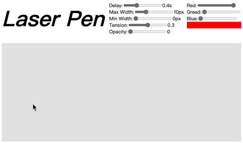
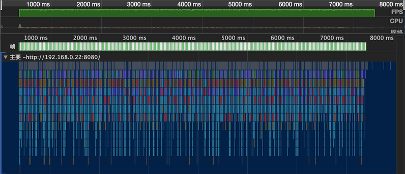
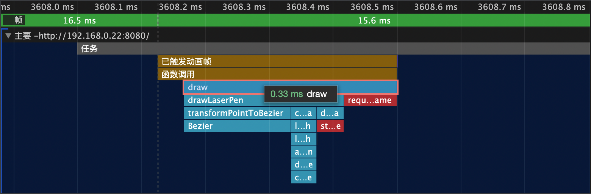

[中文版](./README.ZH_CN.MD)

# Description

Laser Pen is a tool set used to draw mouse trails on the web canvas.



As we all know, the requirement from product managers are often wild and strange, so Laser Pen not only provides a method for drawing the mouse trails, but also exports various internal tools and methods, so that developers can achieve various special needs on the basis of this tool set.

# Demo

## [Online demo](https://silenttiger.github.io/laser-pen/)

# How to use

### Start up

First, add Laser Pen into your project dependencies:

```shell
yarn add laser-pen
```

or

```shell
npm i laser-pen
```

Then, listen `mousemove` event to get the coordinates of the mouse trails, and record the timestamp.

```javascript
// get coordinate of canvas
const canvasDom = document.querySelector('canvas')
const canvasPos = canvasDom.getBoundingClientRect()
const ctx = canvas.getContext('2d')
// used to store the data of mouse trails
let mouseTrack = []
// listen mousemove event
document.addEventListener('mousemove', (event) => {
  mouseTrack.push({
    x: event.clientX - canvasPos.x,
    y: event.clientY - canvasPos.y,
    time: Date.now(),
  })
})
```

At last, call `drawLaserPen` to draw mouse trails.

```javascript
import { drainPoints, drawLaserPen } from 'laser-pen'

function draw() {
  // filter out some invalid trajectory coordinates
  mouseTrack = drainPoints(mouseTrack)
  if (mouseTrack.length >= 3) {
    // draw mouse trails
    drawLaserPen(ctx, mouseTrack)
  }
  requestAnimation(draw)
}
```

Now, you have draw mouse trails on canvas.

### Configuration

If the default configuration can not suite your requirement, you may need to use these interfaces to change the appearance of the drawing.

```typescript
// Set delay, the mouse trails point generated by the mousemove event will not be drawn after the delay time is exceeded, it will affect the length of the trajectory
setDelay: (millisecond: number) => void;
// Set the maximum width of the trajectory, trajectory is a curve from thick to thin, maxWidth represents the line width of the thick end
setMaxWidth: (width: number) => void;
// Set the minimum width of the trajectory, trajectory is a curve from thick to thin, minWidth represents the line width of the thin end
setMinWidth: (width: number) => void;
// Set the curve tension, the greater the tension, the smoother the inflection point, otherwise the sharper
setTension: (t: number) => void;
// Set the minimum transparency of the trajectory, trajectory is a curve that changes from opaque to transparent, it represents the opacity at the end of the track
setOpacity: (o: number) => void;
// Set the color of the trajectory
setColor: (r: number, g: number, b: number) => void;
// Set whether the trajectory head is round
setRoundCap: (b: boolean) => void;
```

Calling the above interface at any time will take effect in the next drawing. So if you want to implement a mouse track similar to an RGB marquee, it is also possible.

### Customize

If the interfaces all of the above can not meet your requirements, then you need to do some customized development.

The process of drawing the mouse track is roughly divided into 5 steps:

1. filter out some invalid trajectory coordinates
2. calculate control points from trajectory coordinates
3. transform all the points to Bezier curve
4. Split the curve generated in the previous step into shorter Bezier curves, and calculate the drawing style of each curve
5. Draw each Bezier curve in turn

These 5 steps correspond to the 1st to 5th interfaces below, and the last `drawLaserPen` interface is a combination of the previous 5 interfaces.
If calling `drawLaserPen` directly cannot meet your requirements, you can combine them on the basis of the first 5 interfaces to achieve the effect you want.

```typescript
// Remove the unreasonable data in the original mouse coordinate data, including the coordinates that exceed the delay time, and some coordinates that are arranged illegally
drainPoints: (originalPoints: IOriginalPointData[]) => IOriginalPointData[];
// Calculate the control points of each point according to the coordinate data
calControlPoints: (points: IPoint[]) => IControlPoint[];
// transform mouse coordinate data and control point data into a Bezier curve
transformPointToBezier: (
  points: IPoint[],
  controlPoints: IControlPoint[]
) => Bezier[];
// According to the original Bezier curve data, calculate the data structure for drawing
calDrawingData: (
  bzArray: Bezier[],
  totalLength: number
) => IDrawingBezierData[];
// According to the calculated drawing data, draw the curve onto the canvas
drawDrawingBezierData: (
  ctx: CanvasRenderingContext2D,
  data: IDrawingBezierData[]
) => void;
// A simple entry method to draw the mouse track directly through the processed mouse coordinate data
drawLaserPen: (ctx: CanvasRenderingContext2D, points: IPoint[]) => void;
```

# Performance



As can be seen from the flame graph above, the performance of continuously drawing is quite good, and the frame rate is always around 60fps.



The time for each drawing is basically less than 0.5ms.

According to personal experience, JavaScript libraries, like Laser Pen, that do not rely on DOM and BOM tend to have good performance. JavaScript is very efficient in simple pure mathematics and logic processing.

# License

MIT
