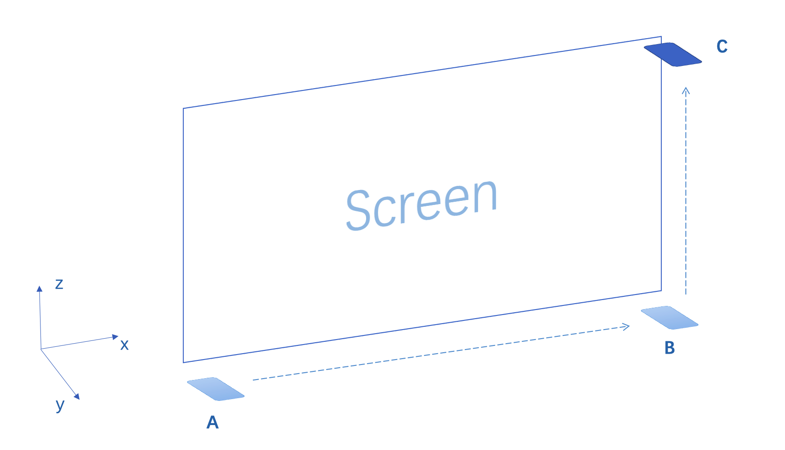
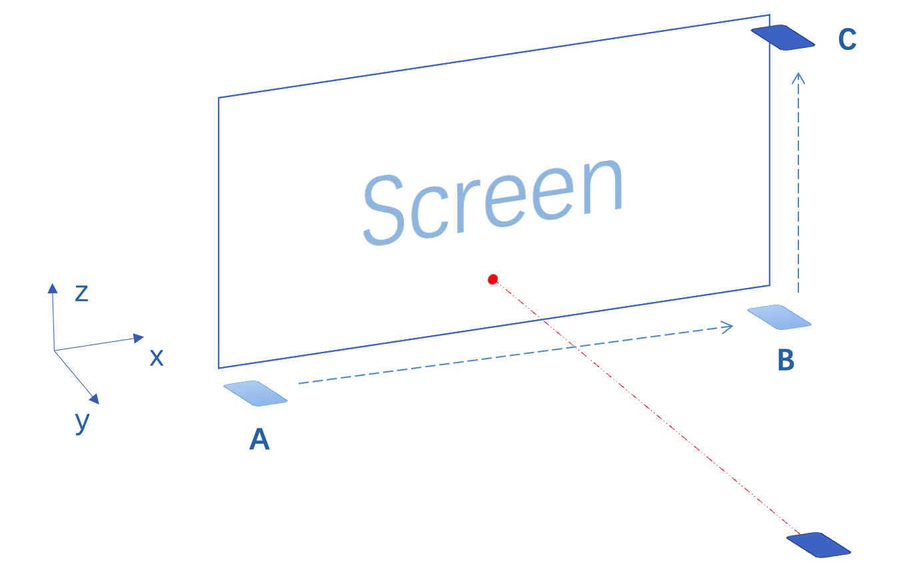
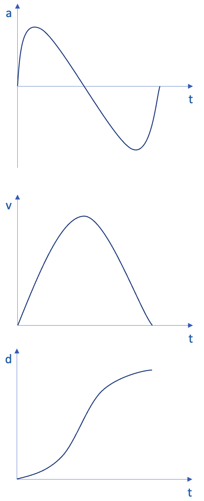
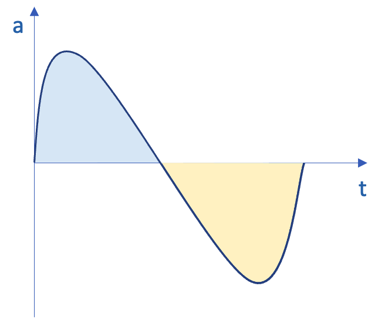
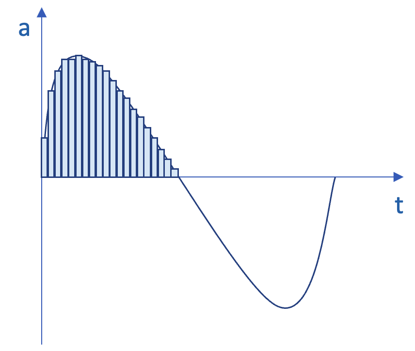
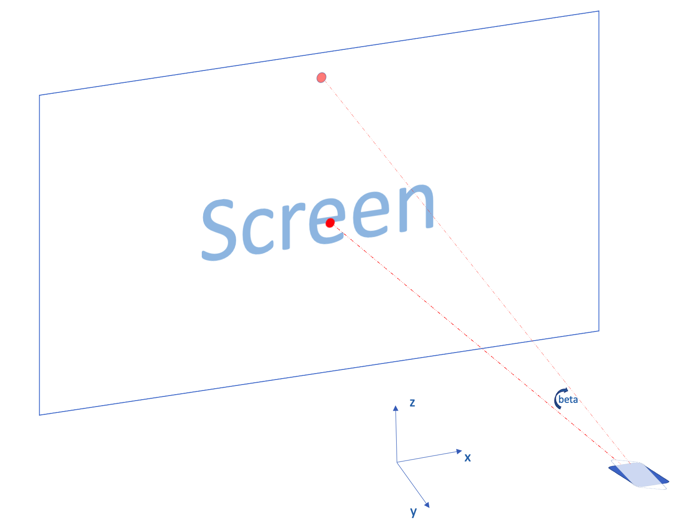
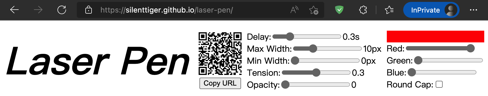

## Introduction

Have you noticed that over the years we are seeing less and less speakers using laser pointer to give the audience instructions on what is being said. First of all, the laser pointer works by shooting a beam of laser light that shines on the curtain and reflects back to the audience's eyes, so you can see a very bright red spot of light. But now because of the large size screen is getting cheaper and cheaper, we are using less and less curtain this traditional projection display equipment, after all, the screen display effect to better. And the screen in order to ensure a good display effect, often in the surface of the glass using a lot of anti-reflection technology. The use of these anti-reflection technology greatly reduces the reflection of the laser, so the end user sees the red dot is less conspicuous, the laser pointer effect is greatly reduced.

So is it possible to replace the laser pointer with the only phone everyone is willing to carry outside? I have tried the following two options.

## 3D simulation solution

Simply put, we use the phone's built-in posture sensor and acceleration sensor to build the orientation and posture of the phone and the display in 3D space, and then use this simulation to calculate if a laser beam is sent from the phone, it will shine to which location on the screen, and draw a red dot at the corresponding location on the screen, so as to achieve the effect of the phone simulation laser pointer.

As shown in the figure above, suppose two adjacent edges of a screen are parallel to the X-axis and Z-axis respectively. When the phone moves from point A to point B along one side of the screen, and then from point B to point C along the other side of the screen, we can calculate the specific position of the screen in the three-dimensional space with point A as the origin.

For example, when we calculate the process of moving from A to B, we only need to use the acceleration sensor on the phone to take out the acceleration of the phone in the x-axis direction at all times, and then multiply it by the time to get the speed of the phone in the x-axis direction at all times, and then multiply the speed by the time to get the distance the phone has moved in the x-axis direction. Simply put, the acceleration of the phone in the x-axis direction is integrated twice in the time dimension.

If we can calculate the position of the screen by moving the phone from point A to point B and C, we can also calculate the spatial position and posture of the phone relative to the screen at any moment, and simulate where a laser beam from the phone will hit the screen.

However, after the experiment I found that although this scheme is theoretically feasible, it is not feasible in practice because of the existence of cumulative errors.

Let's take the most basic scenario of a cell phone moving from point A to point B as an example. When a person moves from A to B with a cell phone, the acceleration, speed and distance of the phone can be described by the following three graphs.

The horizontal axis t represents time, and the vertical axes a, v, and d represent the acceleration, velocity, and distance of the phone in the x-direction, respectively.

In the first graph, the first half of the acceleration is positive and the second half is negative, so the phone first accelerates and then decelerates in the x-direction, and the speed grows from 0 to the maximum and then slowly decreases to 0. The distance traveled is slow at first because the speed is slow, so it grows slowly, and in the middle the speed reaches the maximum and the distance traveled grows fastest, and finally the speed returns to 0 and the distance traveled does not grow.

But the problem is in the acceleration. Originally, the integral of the positive part of the acceleration and the negative part of the integral, that is, the area of the blue area and the area of the yellow area, is exactly the same, so that when the motion process ends the speed of the phone will return to 0, but in reality this is not the case.

First of all, physical quantities in the real world are continuous, and acceleration is of course also continuous, but the acceleration taken on the phone through the various interfaces provided by the operating system is not continuous, but only one value every 16ms. So when calculating the area of the blue and yellow areas, an approximate value can only be obtained by calculating the area of several rectangles and summing them.

Secondly, the acceleration provided by the cell phone OS through the interface and the real acceleration must be different, any measurement has error, only the real value will make the area of the blue and yellow areas exactly the same.

Therefore, due to the above two reasons, after the phone moves from point A to point B, we measure the acceleration and calculate the speed, and finally we find that the speed still does not return to 0 after the phone reaches point B. The speed does not return to 0 means that the system thinks the phone is still moving along the x-axis at a uniform speed, which eventually makes the whole system unusable.

The fundamental problem with the 3D simulation scheme is that we need to integrate in time a quantity that has error, and we all know that error is not terrible, almost all measurements have error, what is worse is the cumulative error, it will make your system run completely out of control after a period of time, and the worse part of the 3D simulation scheme is that this error is accumulated in the time dimension, and time does not stop.

## Attitude Simulation Solution

After the failure of the 3D simulation scheme, I came up with a simplified version of the scheme. Since acceleration is unusable because of the error, can we consider keeping it simple and just use the orientation sensor without the accumulated error to achieve control?

Assuming that the initial position of the phone is right in the center of the screen, then as long as we know the distance from the phone to the screen, and the angle beta of the phone rotating around the x-axis, we can figure out how much distance the red photoelectric will move up. But we do not have a distance sensor, as said before can not use the acceleration to calculate the distance, then we simply further simplify, do not consider the distance, only consider the angle.

We believe that the initial position of the phone is set to the center of the screen, 25 degrees upward rotation around the x-axis, the red dot from the center of the screen to the top of the screen, 25 degrees downward rotation around the x-axis, the red dot moved to the bottom of the screen. When the phone is rotated 25 degrees around the z-axis, the red dot moves to the far left and far right of the screen, respectively. In this way, we can achieve the effect of simulating a laser pointer with just a simple posture sensor.

Experiments show that this solution is perfectly feasible and the code logic is simple. Of course, this approach assumes the initial posture of the phone, in fact, it also assumes the distance from the phone to the screen (you can think about why it also assumes the distance from the phone to the screen ^\_^), the user may feel slightly unnatural when using it. At the same time, in order to better and more convenient control experience, you also need to add some functions that allow users to reset the phone's posture.

## Demo

The posture simulation solution described in this article can be experienced in the [Laser Pen Demo](https://silenttiger.github.io/laser-pen/), the code of which is in the example directory of [Laser Pen - Github](https://github.com/SilentTiger/laser-pen).
After opening the demo page in a PC browser and waiting for a few seconds, you should see a QR code generated in the header of the page.

When the control page on your phone says "Connected", you can try to control the little red dot on the PC page by waving your phone.

There are two more points about this demo.

First, the cell phone posture data obtained in the demo is sent directly to the PC page via WebRTC technology, so you don't have to worry about the leakage of sensitive personal information.

Secondly, although the main communication means of the demo is WebRTC, the process of WebRTC link establishment requires some message pushing means, so the demo also uses socket.io

Finally, the demo uses a free backend service, which will stop automatically when no one visits for a period of time, and the next time you visit it, you have to wait nearly two minutes for the service to start up. So if you open the pc page and find that the QR code is not displayed, you can go to drink a glass of water and then come back to refresh the page to try.

Finally

Welcome to star, pr, issue my project [Laser Pen - Github](https://github.com/SilentTiger/laser-pen)